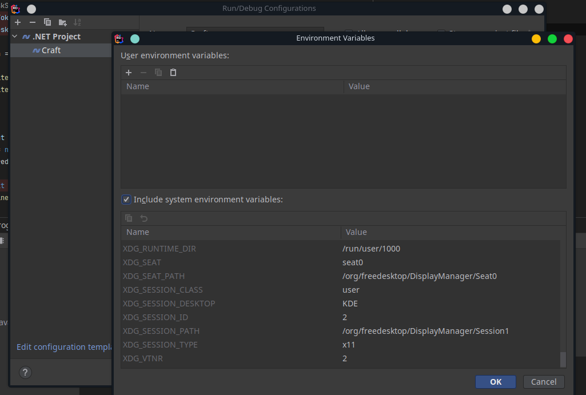
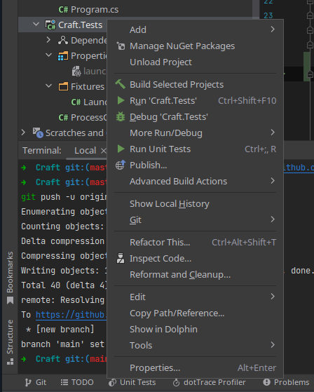
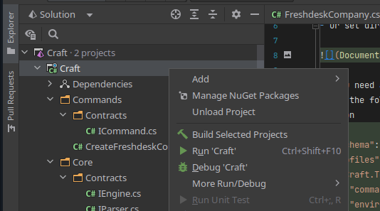

# Craft

1. You need your GitHub personal access token stored in GITHUB_TOKEN environmental variable and Freshdesk API key stored in FRESHDESK_TOKEN environmental variable.
- Linux - export VARNAME="my value"
- Windows/macOS/Linux - https://www3.ntu.edu.sg/home/ehchua/programming/howto/Environment_Variables.html
- Or set directly in IDE



2. You need an `launchSettings.json` file in the `Properties` directory, in the `Craft.Tests` project in order for the unit tests to work properly
- Use the following template
```json
{
  "$schema": "http://json.schemastore.org/launchsettings.json",
  "profiles": {
    "Craft.Tests": {
      "commandName": "Project",
      "environmentVariables": {
        "FRESHDESK_TOKEN": "Your Token",
        "GITHUB_TOKEN": "Your Token"
      }
    }
  }
}
```

3. To run the unit tests, right-click on the `Craft.Tests` project and click `Run Unit Tests`.



4. To start the program, right-click on the `Craft` project and click `Run 'Craft'`.
- Additional information is given by the program itself.

